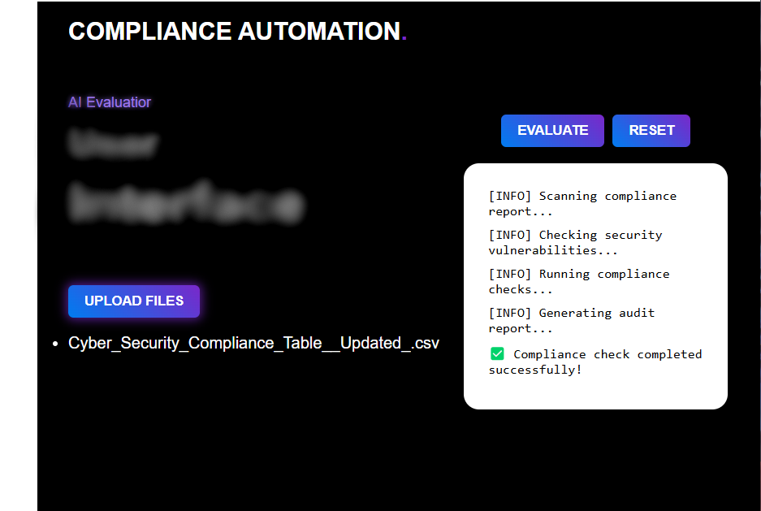

# LLM-Driven Cybersecurity Compliance Evaluator

## Overview

LLM-Driven Cybersecurity Compliance Evaluator is a Python-based tool that utilizes artificial intelligence (AI) to assess a company's cybersecurity controls against National Cybersecurity Authority (NCA) compliance requirements. The evaluator processes control data from CSV files, applies AI-driven analysis to determine whether each control is 'Met,' 'Partially Met,' or 'Not Met,' and exports the results to an Excel file.

## Features

- **Automated Compliance Assessment:**  
  Evaluates cybersecurity controls by interacting with an LLM to return standardized responses.
  
- **Data Processing:**  
  Reads compliance requirements and company controls from CSV files and exports the results to Excel.
  
- **User-Friendly Interface:**  
  Provides an interactive UI to load input files, trigger evaluations, and view/export results without writing code.
  
- **AI Integration:**  
  Utilizes the Ollama API for real-time analysis and decision-making.

## Tech Stack

- **Programming Language:** Python
- **Data Handling:** Pandas
- **User Interface:** (HTML)
- **AI Integration:** Ollama API
- **Output Format:** Excel (using Pandas' `to_excel` functionality)
